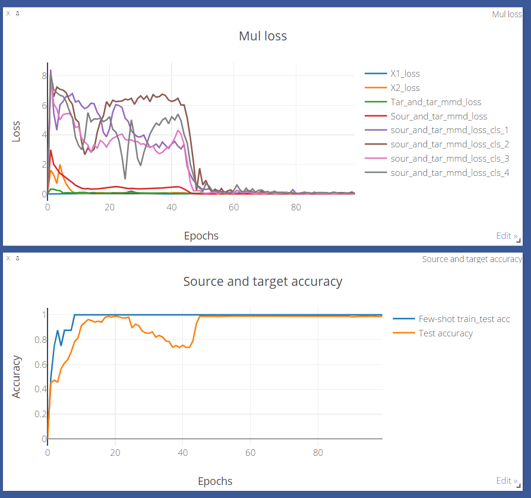

# Few-shot Metric Adversarial Domain Adaptation for Cross-machine Fault Diagnosis
##1. Importance
###1.1 FMAA-Pytorch
- pytorch implement for the CDC 2024 paper [Few-Shot Metric Adversarial Domain Adaptation for Cross-machine Fault Diagnosis](https://arxiv.org/abs/1711.02536)

###1.2 Install dependencies
* This code has been tested on  Python 3.8. pytorch 1.10.2. 
* Install [PyTorch, torchvision](http://pytorch.org/) .
###1.3 Preliminary
- [《A lightweight and robust model for engineering cross-domain fault diagnosis via feature fusion-based unsupervised adversarial learning》](10.1016/J.MEASUREMENT.2022.112139) 
- 《Generative Adversarial Nets》  
- 《Domain-Adversarial Training of Neural Networks》  
- 《Unsupervised Domain Adaptation by Backpropagation》
###1.4 Public datasets used in the paper
- [**Soochow University Dataset**](https://drive.google.com/drive/folders/1rDhPxlUmC9QAIEbFTQ1HEWfeP6bmY6HA)
 - File names of four working conditions of the data set：
 SBDS\_0K\_4\_06.mat, SBDS\_1K\_4\_06.mat, SBDS\_2K\_4\_06.mat, SBDS\_3K\_4\_06.mat.
 - Training set size：size = [1600, 1, 32, 32]  
 - Testing set size：size = [800, 1, 32, 32]
 - Number of health states: 4  
- [**Case Western Reserve University Dataset**](https://drive.google.com/drive/folders/1kC76-QHKUnEUyjOdeqmSkmPRc4oztCOO)
 - File names of four working conditions of the data set：CWRU\_0hp\_4.mat, CWRU\_1hp\_4.mat, CWRU\_2hp\_4.mat, CWRU\_3hp\_4.mat.
 - Training set size：size = [1600, 1, 32, 32]  
 - Testing set size：size = [800, 1, 32, 32] 
 - Number of health states: 4 
##2.Paper Overview
###2.1 Problems solved
- Research interest in the area of fault diagnosis is shifting from cross-domain to cross-machine, which is crucial for industrial applications with variable operation conditions and different machine configurations.
- Current diagnostic models lack label self-correction strategies, which can cause the model to be difficult to use in transfer tasks with large data distribution differences.  
###2.2 Innovation and Contribution
- FMAA(Few-shot Metric Adversarial Adaptation) is proposed for conducting cross-machine diagnosis tasks on rotating machinery. FMAA employs a metric adversarial approach to aggregate samples belonging to the same category from the SD(Source Domain) and TD(Target Domain), while simultaneously increasing the feature distance between different categories. 
- LSMMD(Label Self-Correcting Maximum Mean Discrepancy) is proposed to correct misclassifications of the model while reducing the conditional distribution differences between the SD and TD.  
- A lightweight attention module is proposed, which enhances the classification performance of the model by extracting high-frequency and low-frequency information from the diagnostic signals.
- We conducted cross-machine experiments using ball screw and bearing datasets, and the proposed model performed remarkably well in the diagnosis task.
###2.3 Key technologies used in the paper
- Generative Adversarial Algorithms;
- Few-shot learning;
- Metric learning;
- Lightweight technology;
- Domain adaptation.  
##3. Introduction to FMAA procedure documents
###3.1 Introduction to functions or classes contained in program files
**To train the model, please run the main function first.**

- **`main.py`**
 - Function: Main function.
- **`ColAttention.py`**  
 - Name: Attention module.  
 - Function: Extracting global and local features.  
- **`MMD_calculatin.py`**  
 - Function：Calculating the MMD loss.  
- **`pretrain_feature_extractor.py`**
 - Function: Pre-trained feature extractor
- **`pretrain_discriminator.py`**
 - Function: Pre-trained group discriminator
- **`adv_train_process.py`**
 - Function: The adversarial training process between feature extractor and discriminator. 
- **`dataloader.py`**
 - Function: Loading data and grouping with few-shots.
- **`files_path.py`**
 - Function: The path of source domain and target domain datasets.
###3.2 Diagnostic model
- **`Lightweight_res_net.py`**
 -  Name: Lightweight network structure
 -  Function: The skeleton of the diagnostic model.
 -  `Lightweight_model`: Feature extractor
 -  `Dmodel`: Group discriminator
 -  `Domain_model`: Domain discriminator
 -  `if __name__ == '__main__':`:Test function
- **`Lightweight_res_blo.py`**
 -  Name: Lightweight network block
 -  Function: Feature extraction block of the diagnostic model.
 -  `InvertedResidual_Block`: Feature extraction block
 -  `if __name__ == '__main__':`:Test function
###3.3 Tunable Hyperparameters
- **domain\_loss\_hyp:** Hyperparameters of domain classification loss for source and target domains.
  - Recommended adjustment range: 0.01~0.2
- **positive\_dcd\_hyp:** Hyperparameters of positive adversarial loss.
  - Recommended value: 1
  - Note: In order to make the model training more stable, this parameter needs to be used in combination with the adaptive decay function.
- **nefative\_dcd\_hyp:** Hyperparameters of negative adversarial loss.
  - Recommended adjustment range: 0.01~0.2
- **sour\_tar\_per\_cls\_hyp:** Hyperparameters of the MMD loss between each class in the source and target domains.
  - Recommended value: 1
  - Note: To make model training more stable, this parameter needs to be used in combination with the adaptive boost function.
- **tar\_tar\_mmd\_hyp:** Hyperparameters of the MMD loss between few-shots and the complete dataset in the target domain.
  - Recommended value: 1
- **Learning rates:** lr=0.001
- **Training batch:** batch_size=64
- **Iterations:** epochs = 100
##4. Training process of FMAA

